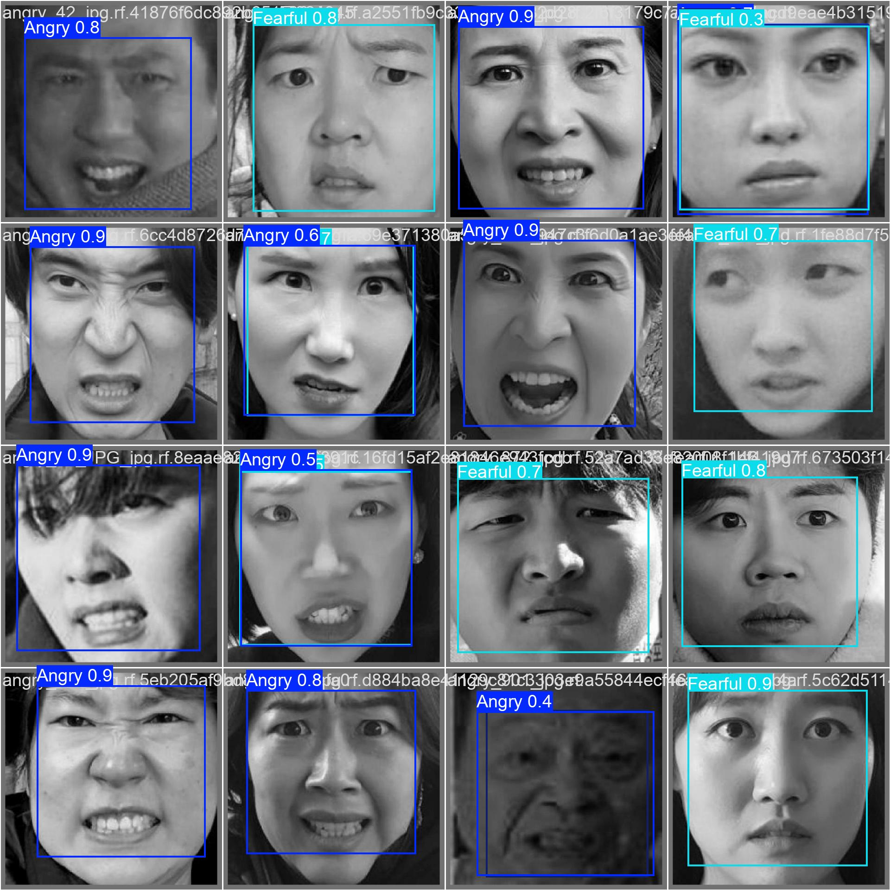

# YOLOv11 Face Emotion Detection

This project implements a face emotion detection system using YOLOv11, trained on a custom dataset to classify emotions into five distinct classes. The model utilizes the Ultralytics YOLO framework for real-time inference.


## Table of Contents

- [Features](#features)
- [Installation](#installation)
- [Usage](#usage)
- [License](#license)
- [Contributing](#contributing)

## Features

- Real-time face emotion detection.
- Custom-trained YOLOv11 model for improved accuracy.
- Supports detection of five emotion classes.

## Installation

To get started, clone the repository and install the required packages.

```bash
git clone https://github.com/alihassanml/Yolo11-Face-Emotion-Detection.git
cd Yolo11-Face-Emotion-Detection
pip install -r requirements.txt
```

Make sure you have the following dependencies installed:

- Python 3.x
- OpenCV
- Ultralytics YOLO

## Usage

To run the model for face emotion detection, use the following script:

```python
from ultralytics import YOLO
import cv2

# Load the trained model
model = YOLO('best.onnx') 

cap = cv2.VideoCapture(0)

while True:
    ret, frame = cap.read()
    if not ret:
        print("Failed to grab frame.")
        break  

    # Convert the frame to grayscale
    gray_image = cv2.cvtColor(frame, cv2.COLOR_BGR2GRAY)
    
    # Convert grayscale to 3-channel image
    gray_image_3d = cv2.merge([gray_image, gray_image, gray_image]) 
    
    # Perform inference
    results = model(gray_image_3d)
    result = results[0]

    # Plot results
    try:
        annotated_frame = result.plot()
    except AttributeError:
        print("Error: plot() method not available for results.")
        break
    
    # Display the output
    cv2.imshow('YOLO Inference', annotated_frame)
    
    if cv2.waitKey(1) == 27:  # ESC key to exit
        break

cap.release()
cv2.destroyAllWindows()
```

## Visualization

The results are visualized using OpenCV, displaying the detected emotions in real-time.

## License

This project is licensed under the MIT License. See the [LICENSE](LICENSE) file for details.

## Contributing

Contributions are welcome! Please feel free to submit a pull request or open an issue for discussion.

---

Feel free to edit the sections to match your project details better. You can also include screenshots or visualizations in the README for added clarity and engagement!
